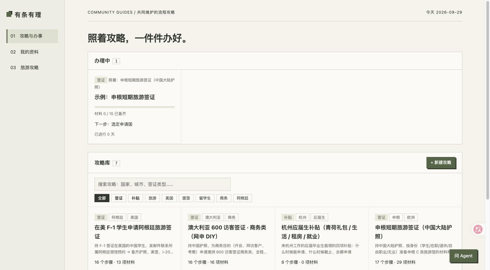
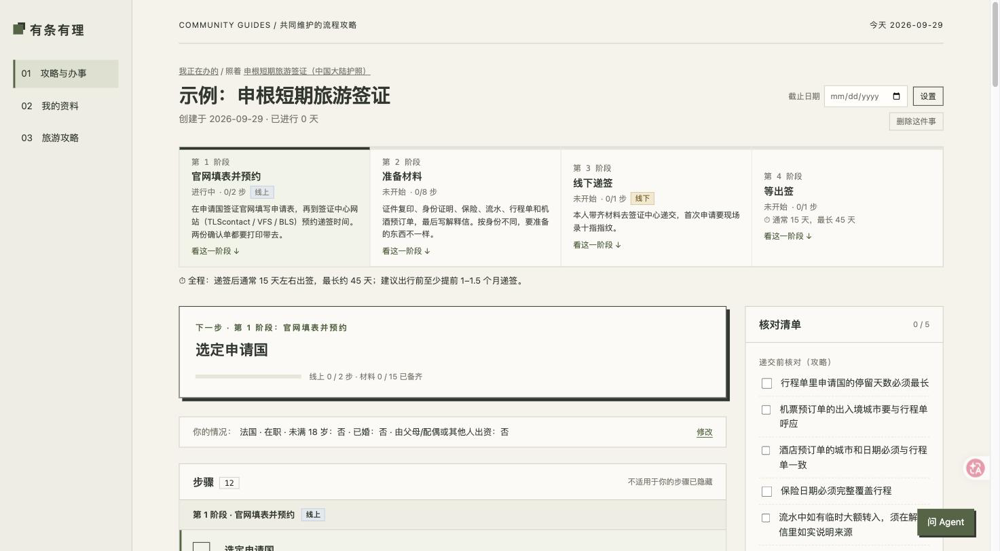
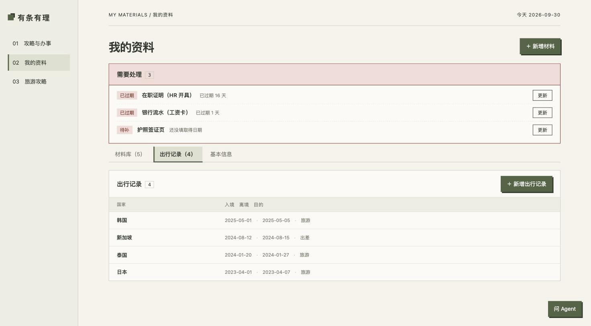
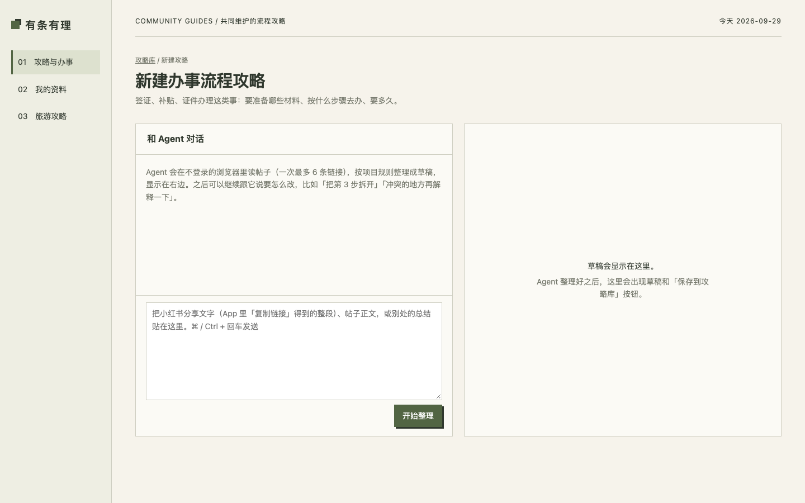

# 有条有理

**把小红书上零散的签证 / 办事攻略，整理成照着做就行的清单，并自动对上你手里已有的材料。**



| 照着攻略办：问几个问题，只留和你有关的步骤和材料 | 材料库：过期、快过期的自动提醒 |
|---|---|
|  |  |

<details><summary>贴帖子让 Agent 整理成攻略</summary>



</details>

<sub>截图里的资料都是虚构的（`uv run youtiao --demo`）。</sub>

办签证、领补贴时，最难的往往不是"去办"，而是弄清楚**到底要办什么**：攻略散在十几篇帖子里，说法互相矛盾；材料有有效期，搞不清哪份还能用；同一份护照、同一份流水，下次办别的事还得重新翻。

有条有理做三件事：

1. **贴帖子 → 攻略**：把几篇小红书帖子的分享链接贴进「新建攻略」，你电脑上的 Claude Code 会在不登录的浏览器里读帖子，整理成一份结构化攻略：先问你几个会影响清单的问题（身份、婚否……），再列出要做哪几步、每步要什么材料、哪些信息必须前后一致。每一条都附原帖里的原话，几篇说法不同的地方会单独标出来，不替你拍板。
2. **我的办事**：挑一份攻略"开始办"，和你无关的材料自动隐藏；它用你本机的材料库对出"哪些已经有、哪些过期了、还缺什么"，告诉你下一步做什么、什么时候该办。
3. **材料和基本信息只录一次**：护照、流水、在职证明记一次有效期，办哪件事都能对上；姓名拼音、住址、学历、工作经历填一次，填表时直接拿来用。

仓库里自带几份整理好的攻略，装好就能直接开始办。

另外还有：

- **填表插件**：装上 Chrome 插件后，在官网上点"填本页"，姓名、生日、护照、地址、电话这些常见格子一两秒填完；填不了的标红框，侧边栏列出你的资料，点一下复制。也可以对某个网站打开"自动填"，翻到下一页就自动填好。签名、付款、提交永远由你自己来。
- **填表对照**：不想装插件，也可以打开「填表对照」页，放在官网旁边自己复制粘贴。
- **导出提醒**：有时间要求的步骤（例如"社保满 6 个月才能申请"）可以导出到日历。

## 你的资料只在你的电脑上

- 攻略是大家的，放在公开的 [`community/`](./community/)，**不含任何个人信息**。
- 你的材料文件、基本信息、办事进度，都在你自己指定的"材料根目录"里（可以是 iCloud / Google Drive 同步目录），永远不进仓库。
- 应用本身不调用任何 AI 模型，不需要 API key，也不会把你的资料发给任何人。Agent 功能用的是你自己电脑上装的 Claude Code，额度也是你自己的。

## 快速开始

需要 [uv](https://docs.astral.sh/uv/)（它会自动准备 Python 3.11+）：

```bash
git clone <仓库地址> && cd personal-assistant
uv sync
uv run youtiao
```

会自动在浏览器里打开 <http://127.0.0.1:8000>。想先用一套虚构资料看看效果：`uv run youtiao --demo`（不会碰你的真实资料）。第一次打开是空的：先到「我的资料」加几份材料、填一下基本信息，再去攻略库挑一份"开始办"。

材料默认存在仓库里的 `materials/`（已被 git 忽略）。想放到别处，把 `config.example.yaml` 复制成 `config.yaml`，改 `materials_root`。

### 可选：填表插件（Chrome）

1. Chrome 地址栏打开 `chrome://extensions`，打开右上角的「开发者模式」。
2. 点「加载已解压的扩展程序」，选仓库里的 `extension/` 文件夹。
3. 点工具栏上的插件图标，右边会打开侧边栏。打开要填的官网，点「填本页」；第一次在某个网站上用，Chrome 会问要不要允许插件读写这个网站，选允许。

插件只和你电脑上的本地服务通信（`uv run youtiao` 要开着），不调用任何 AI。条款禁止自动化的网站（例如澳洲 ImmiAccount），侧边栏会先显示条款原文，你勾选"我知道风险"后才能用。

### 可选：Agent 功能

「新建攻略」、右下角的「问 Agent」和 Agent 填表，需要：

- [Claude Code](https://claude.com/claude-code)，并已登录；
- 读小红书帖子还需要 [Claude in Chrome](https://claude.ai/chrome) 扩展。

装好后重启本地服务，页面会自动检测到。没有装也不影响其他功能。

在终端里用 Claude Code 时（例如让它帮你填表），第一次在项目目录里打开，它会问要不要启用本项目的 MCP 服务 `personal-assistant`，**选启用**：填表、查进度这些工具都在里面。当时选了不启用的话，在 Claude Code 里输入 `/mcp` 重新打开。

## 现有攻略

| 攻略 | 分类 |
|---|---|
| 申根短期旅游签证（中国大陆护照） | 签证 |
| 美国 B1/B2 商务 / 旅游签证（中国大陆申请） | 签证 |
| 美国 F-1 学生签证（中国大陆面签） | 签证 |
| 澳大利亚 600 访客签证 · 商务类（网申 DIY） | 签证 |
| 在美 F-1 学生申请英国标准访客签证（纽约 VFS） | 签证 |
| 在美 F-1 学生申请阿根廷旅游签证 | 签证 |
| 杭州应届生补贴（青荷礼包 / 生活 / 租房 / 就业） | 补贴 |

攻略都整理自公开帖子和官网，**会过时**：每份都写了资料截至什么时候，办之前请以官网为准。

## 分享你整理的攻略（可选）

自己整理的攻略存在 `community/guides/`，觉得对别人有用，欢迎提交一个 Pull Request。

也可以在终端里让你自己的 Agent 按 [`specs/002-guide-to-track/prompt.md`](./specs/002-guide-to-track/prompt.md) 整理。提交前运行一次校验：

```bash
uv run python -m core.guides
```

全部是 ✓ 才算通过。详细规则（尤其是"不能出现任何个人信息"）见 [`community/README.md`](./community/README.md)。

## 边界

- 这不是法律或移民建议。攻略可能过时或有错，以官网和使馆为准。
- 不代你签名、付款、提交，也不处理验证码。
- 使用条款禁止自动化的网站（例如美签预约 USTravelDocs、澳洲 ImmiAccount），Agent 会先告诉你条款原文和风险（账户可能被停），推荐用「填表对照」自己粘贴；要不要让它代填，由你决定。
- 读小红书只用不登录的浏览器、一次最多 6 条，不碰你的账号。

## 项目结构

```
community/     大家共同维护的攻略、材料词表、填表同义词表（公开，不含个人信息）
src/core/      核心逻辑：攻略校验、材料匹配、办事进度计算（纯代码，可单独测试）
src/api/       本地 Web 服务
src/form_engine/  填表引擎和填表对照
src/agent_tools/  给 Agent 用的 MCP 工具
extension/     Chrome 插件（引擎脚本由 scripts/build_extension.py 从 src/form_engine/ 生成）
web/           页面
specs/  docs/  设计文档、路线图、试验记录
```

想参与开发，先读 [`AGENTS.md`](./AGENTS.md)（协作规则）和 [`docs/ROADMAP.md`](./docs/ROADMAP.md)（接下来做什么）。测试：`uv run pytest`。

## 许可证

[MIT](./LICENSE)，包括 `community/` 里的攻略。攻略里摘录的帖子原话（每条不超过 60 字、注明出处）版权归原作者。

---

**English**: Youtiao Youli ("organized") turns scattered visa and paperwork guides from social media into step-by-step checklists, and matches them against the documents you already have. Everything personal stays on your computer; guides are shared in `community/`. The app runs locally and calls no AI model itself; optional agent features use your own Claude Code. Chinese-first for now.
