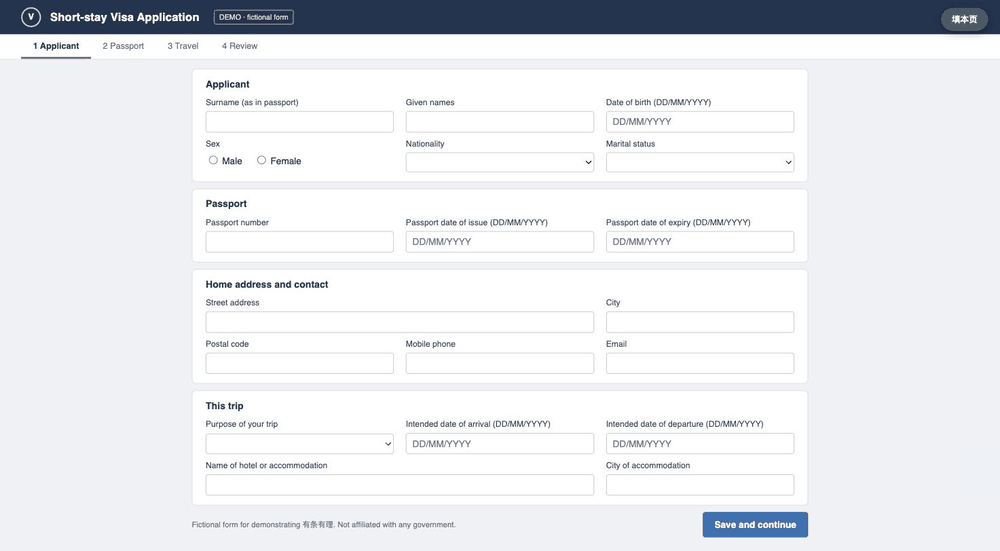
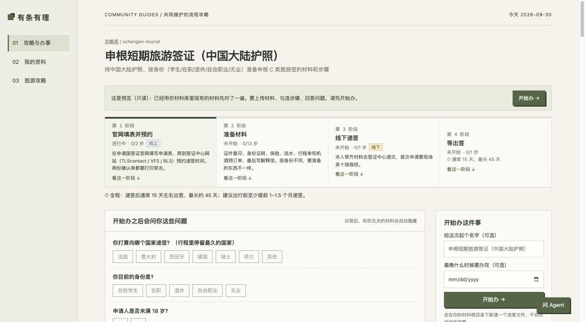
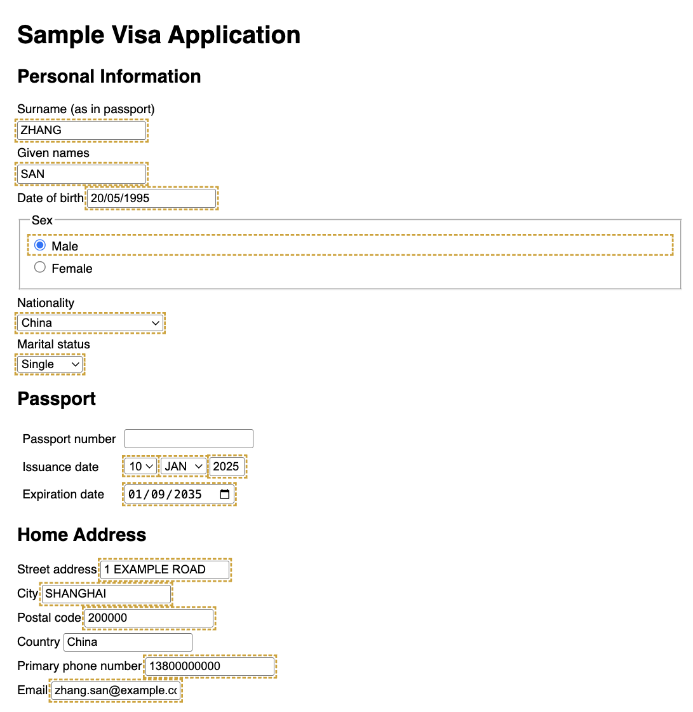
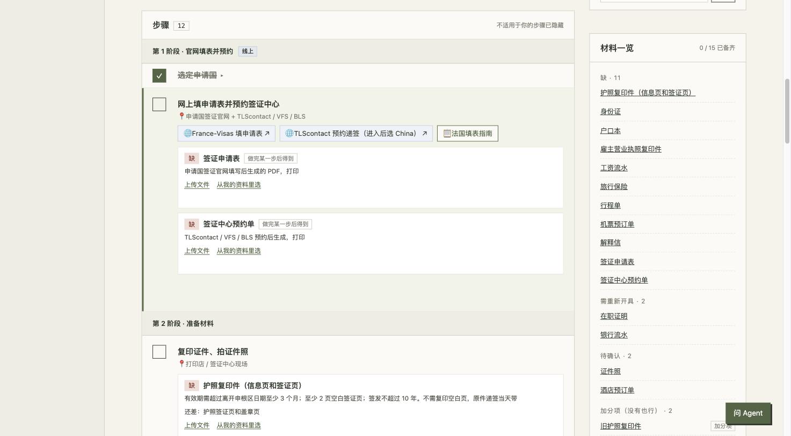

# 有条有理

一个装在自己电脑上的办事助手：把签证、补贴这类事的攻略、材料和官网填表串在一起，Agent 帮你跑腿。



<sub>演示用的是虚构表单和虚构资料，填写由插件背后同一个填表引擎完成（画面里没有录到插件侧边栏）。本页其他截图的资料也都是虚构的。</sub>

## 为什么做这个

办签证时，最让人不想动的往往是这三件事：

1. **攻略太散。** 小红书上搜了一圈、收藏了几十条笔记，真要办的时候翻不过来，几篇的说法还对不上。
2. **同样的材料每次都要重新找。** 护照、流水、在职证明，每办一次事就翻一遍文件夹；哪份过期了，也要一份份看。
3. **官网填表太慢。** 姓名、护照号、地址要一格一格敲，还有些信息平时根本不会记，比如加拿大签证要填过去每一次出境记录。

有条有理把这几步连起来：

- 贴几条笔记链接，Agent 读完，整理成一份攻略：分几步、每步要什么材料、哪几篇说法有冲突。
- 材料和基本信息只录一次。下次办别的事，已有的材料自动对上，快过期的会提醒。出行记录填过一次就一直在。
- 到官网上点一下，插件把认得的格子填好，认不出的交给 Agent 补。

## 安装

### 交给 Agent 装（推荐）

如果你用 [Claude Code](https://claude.com/claude-code)，在终端里打开它，发这句话：

> 按 https://github.com/NowhereMan-in-Galaxy/personal-assistant/blob/main/INSTALL.md 帮我装好有条有理

它会下载项目、装好依赖、问你资料想放在哪、启动，最后告诉你怎么装 Chrome 插件（这一步要你自己点三下）。装完说一句"带我上手"，它会接着带你挑攻略、登记材料。

目前只在 Mac 上的 Claude Code 里完整走过这个流程。其他 Agent 也可以试，它们会读同一份 [`INSTALL.md`](./INSTALL.md)。

### 自己装

<details><summary>展开看步骤（大约 10 分钟）</summary>

1. 装 [uv](https://docs.astral.sh/uv/)（它会顺便准备好 Python）。打开「终端」，运行：

   ```bash
   curl -LsSf https://astral.sh/uv/install.sh | sh
   ```

   装完关掉终端再打开。Windows 用 PowerShell 运行 `powershell -ExecutionPolicy ByPass -c "irm https://astral.sh/uv/install.ps1 | iex"`。

2. 在本页上方点 **Code → Download ZIP**，解压，比如放到「文稿」里（文件夹叫 `personal-assistant-main`）。会用 git 的话也可以 `git clone`。

3. 启动（第一次要等一两分钟）：

   ```bash
   cd ~/Documents/personal-assistant-main
   uv run youtiao
   ```

   浏览器会打开 <http://127.0.0.1:8000>。以后每次用都运行这两行，关掉终端就停了。

4. Chrome 插件：地址栏打开 `chrome://extensions`，打开「开发者模式」，点「加载已解压的扩展程序」，选项目里的 `extension` 文件夹。

5. Agent 功能要装好 [Claude Code](https://claude.com/claude-code) 并登录；让 Agent 读小红书帖子还要 [Claude in Chrome](https://claude.ai/chrome)。不装也能用其他功能。

想先看看效果，运行 `uv run youtiao --demo`，打开的是一套虚构资料。

</details>

## 以一次申根签证为例

### 1. 创建攻略

在攻略库点「+ 新建攻略」，贴几条小红书笔记的分享链接。Agent 在不登录的浏览器里读这些帖子（一次最多 6 条，不碰你的账号），整理成一份攻略：

- 先问你几个会影响清单的问题，比如在职还是学生、去哪国递签；
- 分阶段列出步骤，每一步要准备什么材料、在哪办；
- 每一条都附原帖里的原话。几篇说法不一样的地方单独标出来，由你判断。



仓库里已经有几份整理好的攻略（见下面[现有攻略](#现有攻略)），有你要办的事就可以直接用。

### 2. 准备材料

「我的资料」里登记护照、流水、在职证明这些常用材料，填上取得日期。过期、快过期的会排在最上面。基本信息和出行记录也在这里，填一次，以后办什么事都能用。


挑一份攻略点「开始办」，和你无关的步骤和材料会自动隐藏，已经登记的材料自动对上。最上面有一张开始清单：回答问题 → 放进邀请函、酒店订单这些这次行程的材料 → 整理这次行程。如果你早就在桌面建了一个"申根签证"文件夹，直接关联它就行，不用再传一遍。


「这次行程」可以自己填，也可以交给 Agent：说一句"11 月 2 日到 9 日去巴黎玩，自己出钱"，或者让它读你勾选的订单和邀请函。它把目的、日期、住处整理好，你确认之后才保存。填官网时要用的就是这些。


### 3. Agent 填表

装好 Chrome 插件后，在官网上打开侧边栏，选好是哪件事，点「填本页」。姓名、生日、护照、地址、这次的行程日期，一两秒就填好，填过的格子套上黄色虚线框，方便你核对：



插件认不出的格子会标红框，侧边栏里点「交给 Agent」，Agent 看着这些格子，用你的资料补上，缺的会问你。选完"已婚"才冒出来的配偶栏这类，插件会自己再填一轮。

签名、付款、提交、验证码，永远由你自己来。条款禁止自动填表的网站（比如澳洲 ImmiAccount），侧边栏会先把条款原文给你看，推荐你用「填表对照」页自己复制粘贴。

### 4. 跟踪进度

办事页按阶段列出每一步，做完勾上。每一步下面是这一步要交的材料，缺的可以直接上传。右边「材料一览」告诉你还缺什么、哪些要重开。有时间要求的步骤（比如"社保满 6 个月才能申请"）可以导出到日历。



## 你的资料只在你的电脑上

- 材料文件、基本信息、办事进度都存在你电脑上的一个文件夹里，不会上传到任何地方。这个文件夹也可以放在 iCloud 或 Google Drive 里，方便多台电脑同步。
- 仓库里只有代码和攻略。攻略在 [`community/`](./community/) 里，大家一起维护，不含个人信息。
- 软件本身不调用 AI，也不用注册账号。Agent 功能用的是你自己电脑上的 Claude Code。

## 现有攻略

| 攻略 | 分类 |
|---|---|
| 申根短期旅游签证（中国大陆护照） | 签证 |
| 美国 B1/B2 商务 / 旅游签证（中国大陆申请） | 签证 |
| 美国 F-1 学生签证（中国大陆面签） | 签证 |
| 澳大利亚 600 访客签证 · 商务类（网申 DIY） | 签证 |
| 在美 F-1 学生申请英国标准访客签证 | 签证 |
| 在美 F-1 学生申请阿根廷旅游签证 | 签证 |
| 杭州应届生补贴（青荷礼包 / 生活 / 租房 / 就业） | 补贴 |

攻略整理自公开帖子和官网，会过时。每份都写了资料截至哪天，办之前请以官网为准。

## 常见问题

**要花钱吗？**
有条有理本身免费。Agent 功能用的是 Claude Code，需要 Claude 的订阅或 API 额度。

**资料存在哪？**
默认在项目文件夹里的 `materials/`。想换地方，把 `config.example.yaml` 复制成 `config.yaml`，改里面的 `materials_root`。

**怎么更新？**
用 git 装的运行 `git pull`；下载 ZIP 的重新下载覆盖。你的资料不在代码里，不会被覆盖。

**攻略写错了、过时了？**
[提一个 issue](../../issues/new/choose)，或者直接改 `community/guides/` 里的文件提 Pull Request，见 [`CONTRIBUTING.md`](./CONTRIBUTING.md)。

## 边界

- 这不是法律或移民建议。攻略可能过时或有错，以官网和使馆为准。
- 不代你签名、付款、提交，也不处理验证码。

## 参与

分享攻略、报告问题、一起写代码，都见 [`CONTRIBUTING.md`](./CONTRIBUTING.md)。

## 许可证

[MIT](./LICENSE)，包括 `community/` 里的攻略。攻略里摘录的帖子原话（每条不超过 60 字，注明出处）版权归原作者。

---

**English**: *Youtiao Youli* is a local assistant for visa and paperwork errands. It turns scattered social-media guides into step-by-step checklists, keeps your documents and personal details in one place so they are matched automatically next time, and fills common fields on official application sites through a Chrome extension, with an agent (Claude Code) handling the rest. Everything personal stays on your computer. To install, ask Claude Code to follow [`INSTALL.md`](./INSTALL.md). The interface is in Chinese for now.
