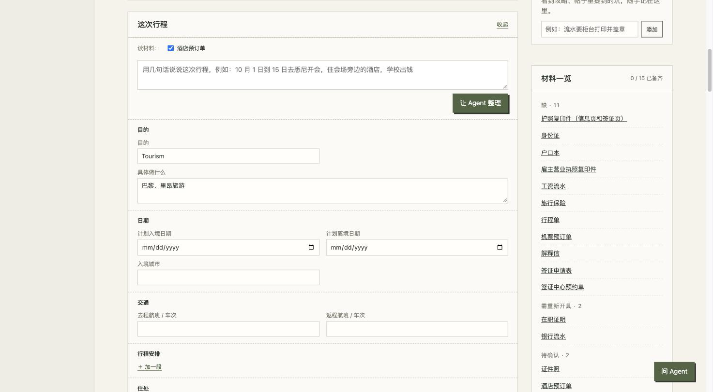

# 有条有理

**办签证、领补贴，把散在各处的攻略整理成一张清单，一步步照着做。**


<sub>截图里的资料都是虚构的。</sub>

## 它解决什么问题

准备办一件事的时候，你大概会经历这些：

- 在小红书翻了十几篇帖子，说法各不相同，不知道该信哪篇；
- 材料一大堆，哪份过期了、哪份还没开，全靠脑子记；
- 到官网填表，护照号、地址、工作经历又要一格一格敲一遍。

有条有理就是为这几件事做的。它是一个**装在你自己电脑上**的小工具，用浏览器打开就能用。

## 以办一次申根签证为例

**1. 挑一份攻略，点"开始办"。** 攻略先问你几个问题，比如在职还是学生、去哪个国家，然后只留下和你有关的步骤和材料。

**2. 按开始清单准备。** 最上面有一张三步的小清单：回答问题 → 放进邀请函、酒店订单这些和行程有关的材料 → 整理这次行程。你也可以直接关联桌面上早就建好的"申根签证"文件夹，不用把文件再传一遍。


**3. 让 Agent 帮你整理行程。** 用一句话说"11 月 2 日到 9 日去巴黎玩，住某某酒店"，或者让它读你勾选的订单和邀请函，它会把目的、日期、住处整理好，**你确认之后才保存**。



**4. 看材料缺什么。** 你之前登记过的护照、流水、在职证明会自动对上；右边「材料一览」告诉你哪些已经有、哪些过期了、还缺什么。

**5. 到官网填表。** 装上 Chrome 插件，在官网上点"填本页"，姓名、生日、护照、地址、这次的行程日期几秒钟就填好。填不了的格子标红框，你自己补。**签名、付款、提交永远由你来点。**

材料和基本信息只需要录一次，下次办别的事还能接着用。

## 你的资料只在你的电脑上

- 你的材料文件、基本信息、办事进度，都存在你自己电脑上的一个文件夹里，**不会上传到任何地方**。这个文件夹也可以放在 iCloud 或 Google Drive 里，方便多台电脑同步。
- 仓库里只有攻略和代码。攻略放在 [`community/`](./community/) 里，大家一起维护，**不含任何个人信息**。
- 软件本身不调用任何 AI，也不需要注册账号。Agent 功能是可选的，用的是你自己电脑上的 Claude Code。

## 安装（大约 10 分钟）

需要：一台 Mac（Windows 和 Linux 应该也能用，但测试得少），以及 Chrome 浏览器。

**第 1 步：装 uv**（一个帮你准备 Python 环境的小工具，只装一次）

打开「终端」（在启动台里搜"终端"），粘贴下面这行，按回车：

```bash
curl -LsSf https://astral.sh/uv/install.sh | sh
```

装完后把终端关掉，再重新打开一次。

<details><summary>Windows 用户</summary>

打开 PowerShell，运行：

```powershell
powershell -ExecutionPolicy ByPass -c "irm https://astral.sh/uv/install.ps1 | iex"
```

</details>

**第 2 步：下载这个项目**

在本页上方点绿色的 **Code → Download ZIP**，解压到你喜欢的位置，比如「文稿」。解压出来的文件夹叫 `personal-assistant-main`。会用 git 的话也可以 `git clone`。

**第 3 步：启动**

在终端里进入刚才解压的文件夹，然后启动。第一次启动会自动下载需要的东西，要等一两分钟：

```bash
cd ~/Documents/personal-assistant-main
uv run youtiao
```

浏览器会自动打开 <http://127.0.0.1:8000>。以后每次想用，都在终端里运行这两行；用完直接关掉终端窗口就行。

**先看看效果？** 运行 `uv run youtiao --demo`，打开的是一套虚构的资料，随便点，不会影响你自己的数据。

**第一次正式使用**：先到「我的资料」登记几份常用材料（护照、流水……），填一下基本信息，再去攻略库挑一份"开始办"。右下角的「问 Agent」里点"带我上手"，它会一步步带你走一遍（需要下面的 Agent 功能）。

## 可选功能

### Chrome 填表插件

1. 在 Chrome 地址栏打开 `chrome://extensions`，打开右上角的「开发者模式」。
2. 点「加载已解压的扩展程序」，选项目里的 `extension` 文件夹。
3. 点工具栏上的插件图标，右边会打开侧边栏。到要填的官网，先在顶部选「这件事」，再点「填本页」。

插件只和你电脑上的有条有理通信，所以用的时候 `uv run youtiao` 要开着。有些网站的条款禁止自动填表，比如澳洲 ImmiAccount，侧边栏会先把条款原文给你看，由你决定用不用。

### Agent 功能

「让 Agent 整理」行程、「新建攻略」和右下角的「问 Agent」需要：

- 装好 [Claude Code](https://claude.com/claude-code) 并登录；
- 如果要让它读小红书帖子来整理攻略，还要装 [Claude in Chrome](https://claude.ai/chrome) 扩展。它只用不登录的浏览器读帖子，不会碰你的账号。

装好后重启有条有理，页面会自动发现它。不装也不影响其他功能。

## 现有攻略

| 攻略 | 分类 |
|---|---|
| 申根短期旅游签证（中国大陆护照） | 签证 |
| 美国 B1/B2 商务 / 旅游签证（中国大陆申请） | 签证 |
| 美国 F-1 学生签证（中国大陆面签） | 签证 |
| 澳大利亚 600 访客签证 · 商务类（网申 DIY） | 签证 |
| 在美 F-1 学生申请英国标准访客签证 | 签证 |
| 在美 F-1 学生申请阿根廷旅游签证 | 签证 |
| 杭州应届生补贴（青荷礼包 / 生活 / 租房 / 就业） | 补贴 |

攻略整理自公开帖子和官网，**会过时**。每份都写了资料截至哪天，办之前请以官网为准。

没有你要办的事？点攻略库的「+ 新建攻略」，贴几篇帖子的链接，Agent 会帮你整理成一份新攻略，每一条都附上原帖里的原话，说法冲突的地方会单独标出来。

<details><summary>贴帖子整理攻略的样子</summary>


</details>

## 常见问题

**要花钱吗？**
有条有理本身免费。Agent 功能用的是 Claude Code，要有 Claude 的订阅或者 API 额度。

**我的资料存在哪？**
默认存在项目文件夹里的 `materials/`。想换地方（比如 iCloud），把 `config.example.yaml` 复制一份改名为 `config.yaml`，改里面的 `materials_root`。

**怎么更新到新版本？**
重新下载 ZIP 覆盖，或者用 git 的话运行 `git pull`。你的资料在 `materials/` 或你自己指定的文件夹里，不会被覆盖。

**攻略写错了、过时了怎么办？**
欢迎[提一个 issue](../../issues/new/choose)（选"攻略过时了"），或者直接改好 `community/guides/` 里的文件提交 Pull Request，见 [`CONTRIBUTING.md`](./CONTRIBUTING.md)。

**它会替我提交申请吗？**
不会。签名、付款、提交、验证码，永远由你自己来。

## 边界

- 这不是法律或移民建议。攻略可能过时或有错，以官网和使馆为准。
- 不代你签名、付款、提交，也不处理验证码。
- 使用条款禁止自动化的网站，会先告诉你条款原文和风险，推荐你用「填表对照」页自己复制粘贴。

## 参与

想分享攻略、报告问题或一起开发，请看 [`CONTRIBUTING.md`](./CONTRIBUTING.md)。

## 许可证

[MIT](./LICENSE)，包括 `community/` 里的攻略。攻略里摘录的帖子原话（每条不超过 60 字，注明出处）版权归原作者。

---

**English**: *Youtiao Youli* ("well organized") turns scattered visa and paperwork guides into step-by-step checklists, matches them against the documents you already have, and fills common fields on official application sites through a Chrome extension. Everything personal stays on your computer; guides are shared in `community/`. The app itself calls no AI model; optional agent features use your own Claude Code. The interface is in Chinese for now.
